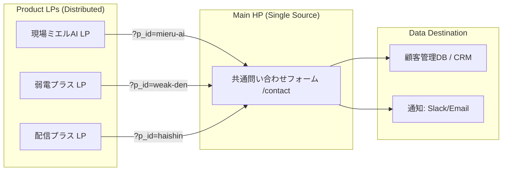

# IYASAKA Lead-Capture Technical Protocol

## 1. リード獲得の全体構造（データフロー）

全てのプロダクトLPは「独立した集客装置」として機能しますが、リード（問い合わせ）の出口は「IYASAKA公式サイト（母艦）」へ集約します。



---

## 2. URLパラメータ設計（共通規格）

各プロダクトLPのCTA（問い合わせボタン）は、以下の規格に基づいたURLを生成してください。

* **ベースURL:** `https://iyasaka.co.jp/contact`
* **必須パラメータ:** `p_id` (Product ID)
* **オプション:** `utm_source` (流入経路), `utm_campaign` (キャンペーン名)

### プロダクトID（p_id）一覧

各AIは、自らが担当する製品に応じて以下のIDをリンクに使用すること。

* `dev-os` : dev-OS
* `weak-den` : 弱電プラス
* `mieru-board` : 現場ミエルAI (ボード)
* `mieru-stock` : 現場ミエルAI (ストック)
* `mieru-drive` : 現場ミエルAI (ドライブ)
* `mieru-file` : 現場ミエルAI (FILE)
* `haishin` : 配信プラス
* `tagengo` : 多言語プラス
* `omo-ai` : OmotenasuAI
* `ai-plus` : AIプラス

---

## 3. LP側：実装プロトコル（AIへの指示）

各プロダクトLPを構築するAIは、以下のコード・ロジックを実装してください。

### CTAボタンの実装

```html
<a href="https://iyasaka.co.jp/contact?p_id=mieru-ai" class="cta-button">
  無料で「不」を「光」に変える相談をする
</a>
```

### dev-OS 準拠のガバナンス

* リンクには必ず `rel="noopener noreferrer"` を付与すること（セキュリティ確保）。
* クリックイベントを計測するための `data-analytics-id` を付与することを推奨。

---

## 4. HP側（母艦）：フォーム受信ロジック

公式サイトの問い合わせフォームを構築するAIは、以下の機能を実装してください。

### ① パラメータ自動検知機能

URLの `p_id` を検知し、フォーム内の「興味のある製品（セレクトボックス）」の初期値を自動的に変更する。

```javascript
// 実装イメージ（AIへの指示用）
window.addEventListener('DOMContentLoaded', () => {
    const params = new URLSearchParams(window.location.search);
    const productId = params.get('p_id');
    if (productId) {
        const selectElement = document.getElementById('inquiry_product');
        if (selectElement) {
            selectElement.value = productId; // パラメータに一致する値を初期選択
        }
    }
});
```

### ② 隠しフィールド（Hidden Fields）

解析用に、どの `p_id` から来たのかを隠しフィールドに保持し、送信データに含める。

```html
<input type="hidden" name="origin_product_id" id="hidden_p_id">
```

---

## 5. サンクスページとリターゲティング

* 問い合わせ完了後の「サンクスページ」では、**「IYASAKAの他製品」**をレコメンドするセクションを設ける。
* 例：「現場を整えた後は、世界とつなぎませんか？（多言語プラスの紹介）」

---

## 6. 各プロダクトAIへの「最終念押し」プロンプト

このフローを各AIに徹底させるための、コピー＆ペースト用プロンプトです。

> **【技術実装命令】**
> 本プロジェクトにおける「リード獲得フロー」はIYASAKA共通プロトコルに従います。
> 1. 全てのCTAリンクは `https://iyasaka.co.jp/contact?p_id=[担当プロダクトID]` 形式で作成してください。
> 2. リンク先はIYASAKA公式サイトの共通フォームに集約し、LP側で独自のフォームは作成しないでください。
> 3. このフローにより、顧客データがIYASAKAの「弥栄循環（エコシステム）」に正しく統合されることを保証してください。
> 4. 実装の整合性は dev-OS のガバナンス基準に照らしてチェックしてください。


